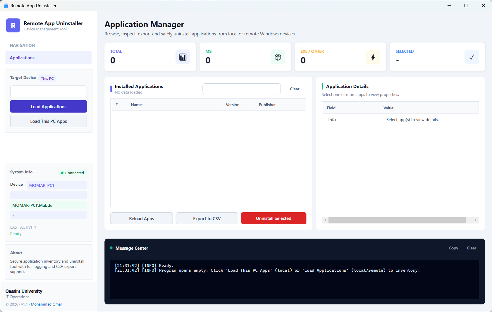

<div align="center">

# 📦 Remote App Uninstaller

**WPF GUI for Windows application management**

Browse, inspect, export, and silently uninstall applications from local or remote Windows machines — with automatic silent-switch detection, WinGet fallback, and leftover cleanup.


[Features](#-core-features) • [Architecture](#️-architecture) • [Uninstall Engine](#-uninstall-engine) • [Requirements](#️-requirements) • [Troubleshooting](#-troubleshooting)

</div>

---

# 📖 Overview

**Remote App Uninstaller** is a modern WPF-based GUI tool for Windows application management. It reads the installed-app inventory from the registry (64-bit and 32-bit views), provides real-time filtering and a full property inspector, and runs uninstalls in background jobs with automatic silent-switch detection, WinGet fallback, and leftover cleanup — locally or over WinRM.

The entire tool is a **self-contained single script** (`RemoteAppUninstaller.ps1`, ~3,300 lines): no external modules, no config files, no installer.

---

## 🖼️ Screenshots



*Main window: stats dashboard, live-filtered app list, full property inspector, per-job uninstall progress rows, and the dark Message Center.*

---

# 🚀 Quick Start

```powershell
.\RemoteAppUninstaller.ps1
```

Or bypass the execution policy:

```powershell
powershell.exe -ExecutionPolicy Bypass -File .\RemoteAppUninstaller.ps1
```

Double-click `RemoteAppUninstaller.exe` also works (compiled launcher, no console window). The window opens empty — click **Load This PC Apps** (local) or **Load Applications** (local or remote) to inventory a machine.

### Control Reference

| Control | Behavior |
|---|---|
| **PCNameBox** | Type a computer name/IP, or leave empty for the local machine. `Enter` triggers a load |
| **Load Applications** | Inventory the target from the box (local if empty) |
| **Load This PC Apps** | Inventory the local machine only |
| **Reload Apps** | Re-inventory the current target |
| **Export to CSV** | Save the currently filtered list to CSV |
| **Uninstall Selected** | Opens the confirmation dialog, then launches a background uninstall job |
| **SearchBox / Clear** | Live regex filter + reset |
| **Copy / Clear (Message Center)** | Copy all output to clipboard / wipe the log view |
| **Stop (per job)** | Cancels a running uninstall job |

### Keyboard & Mouse

* `Enter` in the PC-name box → **Load Applications**
* `Ctrl+C` or double-click on a details row → copies `Field: Value`
* Right-click a details row → **Copy Field** / **Copy Value**
* `Ctrl+click` in the app list → multi-select (comparison view)

---

# ✨ Core Features

### 🔹 Application Inventory
* **Local & remote inventory** — reads both registry views: `HKLM:\SOFTWARE\...\Uninstall` and `HKLM:\SOFTWARE\WOW6432Node\...`
* **WinRM remote access** — via `Invoke-Command` with an ICMP connectivity pre-check
* **Load on demand, never freezes** — inventory runs in a `Start-Job`; the UI shows a progress overlay until it finishes, then auto-refreshes after uninstalls

### 🔹 Live Sidebar & Stats
* **Target device card** — Connected/Offline indicator, This PC (blue) vs Remote (orange) badge, device name, IP, logged-on user, OS version, last activity
* **Live stats dashboard** — TOTAL / MSI / EXE-OTHER / SELECTED counters, updated on every selection change

### 🔹 Search & Details Inspector
* **Real-time filtering** — case-insensitive regex across Name, Publisher, and Version
* **Full property grid** — Publisher, Version, InstallDate, UninstallString, Product Code, Upgrade Code, Architecture, and ~30 more fields (empty fields hidden)
* **Multi-select comparison** — compact side-by-side key fields; clipboard copy per field or per row

### 🔹 Silent Uninstall Engine
* **Auto-detection** — MSI, Inno Setup, NSIS, Wise, InstallShield, or generic EXE
* **Correct silent switches** appended per installer type (see [Silent Switch Mapping](#silent-switch-mapping))
* **Safe execution** — commands split into executable + arguments, launched via `Start-Process`, never through a shell
* **Concurrent background jobs** — each batch uninstalls via `Start-Job` with its own live progress row and Stop button
* **Verification** — the registry is re-checked after uninstall; **WinGet fallback** (`winget uninstall --silent`) runs automatically if the traditional uninstall fails
* **Leftover cleanup (best-effort)** — leftover registry keys, Program Files folders, Start Menu shortcuts, and AppData remnants

### 🔹 Export
* **CSV export** — saves the currently **filtered** list with an auto-generated filename (`<device>-<timestamp>-apps.csv`)

---

# 🏗️ Architecture

### Execution Model

```text
PowerShell (STA) ──► WPF Window (Dispatcher)
   │
   ├── LoadJob (Start-Job)      ──► writes to %TEMP%\...\load-<ts>.log
   │                                  └─ LoadTimer (300 ms) polls file → streams to Message Center
   │
   └── UninstallJob xN (Start-Job) ─► writes to %TEMP%\...\uninstall-<id>-<ts>.log
                                       └─ DispatcherTimer polls jobs → per-job progress rows, Stop buttons
```

Background jobs cannot return partial output while running on PowerShell 5.1, so every job **appends its log lines to a live log file** that the UI polls with a timer — this is what makes output stream in real time.

### Code Regions (in file order)

| # | Region | Purpose |
|---|---|---|
| 01 | **ASSEMBLIES & GLOBALS** | WPF/WinForms references, script-scoped state, temp log dir |
| 02–03 | **XAML — MAIN WINDOW** | Window, sidebar, stats cards, app list, details pane, Message Center, job panels |
| 04 | **XAML LOADER (SAFE)** | `Load-XamlWindowSafe` — validates & loads XAML with descriptive errors |
| 05 | **CONTROL BINDING (SAFE)** | `Get-ControlOrFail` — fail-fast `FindName` |
| 06 | **TARGET HELPERS** | `Is-LocalTarget` — local vs remote detection |
| 08 | **SESSION INFO (SIDEBAR)** | Target badge, device card, OS/IP/user rendering |
| 09–11 | **UI HELPERS & LOGGER** | `Invoke-Ui` dispatcher wrapper, `Update-Output` color-coded output, `Set-LastAction` |
| 12 | **STATS (CARDS)** | `Update-Stats` — live Total/MSI/EXE/Selected counts |
| 13 | **DETAILS PANES** | Full property grid + multi-select comparison + copy helpers |
| 14 | **COLLECTION VIEW + FILTER** | `Set-AppList` / `Update-Filter` — CollectionView regex filtering |
| 15 | **GET-INSTALLEDAPPS** | Shared registry inventory scriptblock (local + WinRM) |
| 16 | **BACKGROUND INVENTORY LOAD** | `Start-LoadApps` + `LoadTimer` |
| 17 | **CONFIRMATION DIALOG** | Modal "Confirm Uninstall" window |
| 18 | **UNINSTALL SCRIPTBLOCK** | Background job: silent uninstall, verification, cleanup |
| 19 | **JOB POLLING** | `New-JobRow` / `Start-UninstallJob` + DispatcherTimer |
| 20–22 | **HANDLERS, EVENTS, INIT** | Button handlers, UI events, session setup, WPF message pump |

---

# 🔧 Uninstall Engine

### Silent Switch Mapping

| Installer | Detection | Switches appended |
|---|---|---|
| **MSI** | `msiexec` in the uninstall string | `/x <product-code> /quiet /norestart` (or convert `/i {guid}` → `/x {guid}`) |
| **Inno / NSIS / Wise / InstallShield** | `unins*.exe` in the path | `/VERYSILENT /SUPPRESSMSGBOXES /NORESTART` |
| **Generic EXE** | `.exe` and no silent flag present | `/S` |

The command is then split (`Split-UninstallCommand`) into executable + arguments and launched with `Start-Process` — never through a shell.

### Per-App Removal Pipeline (`Remove-Application`)

1. **Reachability** — for remote targets, a quick ping check (skips unreachable hosts)
2. **Stop processes & services** — matching process names/descriptions and services are force-stopped (remote capped at 45 s)
3. **Run uninstall** — silent switches applied, run hidden with `-Wait`. **Remote:** runs via `Invoke-Command -AsJob` while the app is polled every 15 s for up to **4 minutes** (Inno uninstallers often linger; "gone from remote registry" counts as success). Elevation requests and exit codes surface in the log
4. **Verify** — registry re-checked for a matching `DisplayName` on the target
5. **WinGet fallback** — `winget uninstall --name "<name>" --exact --silent --accept-source-agreements --accept-package-agreements`
6. **Leftover cleanup** — registry keys, Program Files folders, Start Menu entries, AppData remnants (best-effort)

Each app produces `{ App, Status, Note, Details[] }` with `Status` of `Success` or `Failed`; a batch summary with app names is written to the Message Center.

### Data Model (Registry → App Object)

For every registry subkey with a `DisplayName`, the inventory produces an object including: `Name` (DisplayName), `Publisher`, `Version` (DisplayVersion), `InstallDate`, `UninstallString` (normalized: `/i {guid}` → `/x {guid}`), `QuietUninstallString`, `ModifyPath`/`RepairPath`, `InstallLocation`/`InstallSource`, `InstallSize`/`EstimatedSize`, `RegistryKey`, `ProductCode` (falls back to key name if `{GUID}`), `UpgradeCode`, `LanguageCode` (mapped to a friendly name), plus derived fields: `InstallerType` (MSI vs EXE/Other), `Architecture` (x86 via WOW6432Node / x64), `Scope`, and `Index`.

---

# 🧾 Logging

The dark Message Center streams everything with color-coded levels:

| Level | Color | Use |
|---|---|---|
| `INFO` | Grey-blue | General operations |
| `DETAIL` | Light blue | Workflow and connectivity details |
| `RESULT` | Blue | Success results |
| `WARN` | Yellow | Non-fatal warnings |
| `ERROR` | Red | Failures |
| `SUMMARY` | Green | Uninstall job summaries |

Raw log files:

```text
%TEMP%\RemoteAppUninstaller-Logs\
├── load-<yyyyMMddHHmmss>.log               # inventory
└── uninstall-<id>-<yyyyMMddHHmmss>.log     # each uninstall job
```

---

# ⚙️ Requirements

| Requirement | Details |
|---|---|
| **OS** | Windows 10 / 11 |
| **PowerShell** | Windows PowerShell 5.1+ with WPF (.NET Framework) |
| **Local usage** | Normal user rights for inventory; admin may be required for some uninstalls |
| **Remote usage** | WinRM enabled on target, remote management firewall rule open, admin rights on target |
| **Workgroup targets** | May require `TrustedHosts` or CredSSP configuration |
| **Optional** | WinGet CLI for the fallback uninstall |

### Remote Setup Checklist

```powershell
# On the target computer (as admin):
winrm quickconfig

# On the source computer (workgroup / non-domain, one-time):
Set-Item WSMan:\localhost\Client\TrustedHosts -Value "target1,target2" -Force
```

---

# 🔍 Troubleshooting

| Symptom | Fix |
|---|---|
| Script blocked by execution policy | `powershell.exe -ExecutionPolicy Bypass -File .\RemoteAppUninstaller.ps1` |
| Remote load reports unreachable | Check ICMP (firewall), then `Test-WSMan <host>` |
| WinRM access denied / not enabled | `winrm quickconfig` on the target + open the firewall rule |
| Uninstall of Program Files apps fails remotely | Ensure the remote WinRM session is elevated |
| No output while loading | Output streams via the live log file — check `%TEMP%\RemoteAppUninstaller-Logs\` |
| GUI seems slow on remote uninstall | Everything runs in jobs — watch the per-job progress rows |
| `UninstallString` empty | The app may not expose one; the tool logs a warning and still attempts cleanup |

---

# 🛡 Operational Notes

* **Authorization** — uninstalling software on machines you do not own or administer requires explicit permission; inventory data is sensitive too
* **Test in staging** — validate silent switches against a pilot app before batch uninstalls; leftover cleanup is best-effort, not a guarantee
* **Admin rights** — some uninstalls (MSI per-machine, Program Files) require elevation; the tool surfaces elevation requests in the log
* **WinRM security** — restrict `TrustedHosts` to named targets and keep remoting firewall rules scoped to your management subnet
* **Audit trail** — per-job logs under `%TEMP%\RemoteAppUninstaller-Logs\` record every removal; retain them per your org's change-management policy

---

## 📝 Changelog

| Version | Date | Notes |
|---|---|---|
| 1.1 | 2026-08-16 | Full reliability + UX overhaul (details below) |
| 1.0 | 2026-08-05 | Initial release |

### 1.1 — 2026-08-16

**Reliability / bug fixes**

* Fixed GUI crash **"Format specifier was invalid"** — `[math]::Floor()` doubles break `{0:d2}` time formats; values now cast to `[int]` first
* Fixed apps reported **Failed despite being removed** — `Test-AppStillInstalled` used `return` inside `ForEach-Object` (emits a truthy array, doesn't exit); rewritten with `foreach` + `break`
* Remote uninstalls **no longer hang or time out early** — `Invoke-Command -AsJob` + 15 s polling up to 4 minutes; elevation requests, missing executables, and exit codes surfaced in the log
* Process-stop phase **no longer hangs** — remote process stop wrapped in a job with a 45 s `Wait-Job` timeout; matching Windows services also force-stopped

**UX / UI**

* Live **"working m:ss"** elapsed indicator per job + indeterminate progress bar with 20 s heartbeats
* Batch **SUMMARY lists app names**: `SUMMARY: Completed on it-op-031 | Uninstalled: 1 (AnyDesk) | Failed: 0`
* Message Center readability: rule separators, bold violet app headers, indented `DETAIL` lines, SemiBold errors
* Button overhaul: hover/pressed overlays fill the entire button on every style; uniform 5 px radius; visible secondary-button border

---

## 🧭 Roadmap

* Export the details view alongside the CSV
* CredSSP / custom-credential support for domain remote uninstalls
* Per-app install-date sorting and grouping
* Refresh-before-uninstall sanity check (warn if the list is stale)

---

## 👤 Author

**Mohammad Abdulkader Omar**  
GitHub: [@mabdulkadr](https://github.com/mabdulkadr)  
Website: [momar.tech](https://momar.tech)  

---

## 📜 License

This project is licensed under the [MIT License](LICENSE).

---

## ⚠ Disclaimer

This skill and every script it generates are provided as-is with no warranty
of any kind. Test generated tools in a staging environment before deploying to
production. The authors assume no liability for any damage or data loss
resulting from their use.

---

<div align="center">

⭐ **If this tool saves you time, star the repo — it helps others find it.**

[Report an Issue](../../issues) · [momar.tech](https://momar.tech)

[](https://www.buymeacoffee.com/mabdulkadrx)

Built with [**PowerShell Enterprise Admin**](https://github.com/mabdulkadr/powershell-enterprise-admin-skill)

</div>
